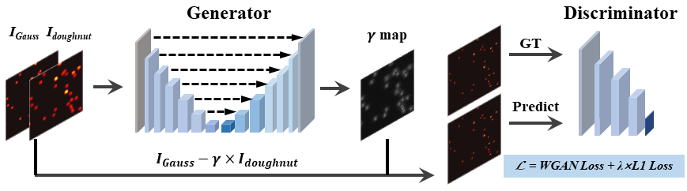
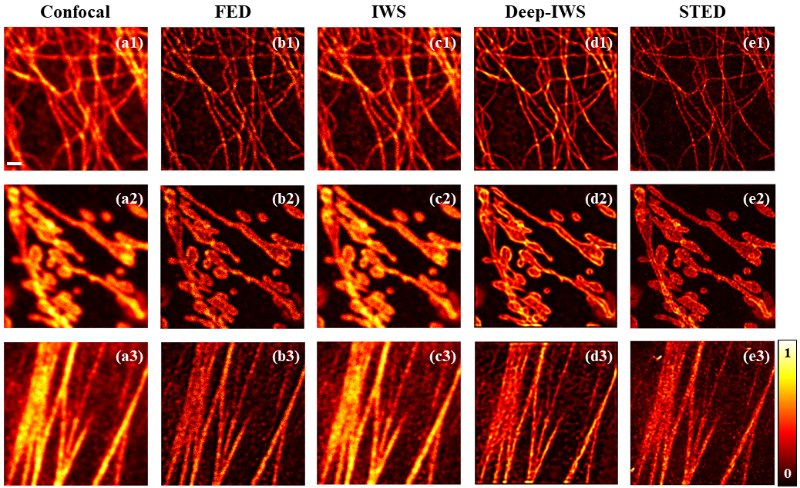

# Resolution and contrast enhancement in weighted subtraction microscopy by deep learning
Official Implementation of the Paper "Resolution and contrast enhancement in weighted subtraction microscopy by deep learning"  

Yuxuan Qiu<sup>#</sup>, Wei Chen<sup>#</sup>, Yuran Huang, Yueshu Xu, Yile Sun, Tao Jiang, Zhimin Zhang, Longhua Tang, Xiang Hao, Cuifang Kuang<sup>*</sup>, Xu Liu 

[Official Publication](https://doi.org/10.1016/j.optlaseng.2023.107503)   

If you have any questions, please directly comment on GitHub or through email: 22030069@zju.edu.cn, 22030006@zju.edu.cn.

## Instruction


In subtraction microscopy, the negative sidelobes are inevitably generated by the difference between the envelopes of 
Gaussian and doughnut point spread functions (PSFs), resulting in undesired information loss. Therefore, the trade-off 
between high resolution and information loss hinders further improvement in the performance of subtraction microscopy. 
Moreover, the postprocessing subtraction algorithms derived from PSF algebra tend to cause artifacts in dense samples. 
Herein, we propose an adaptive algorithm for assignment of the subtractive coefficient based on deep learning, termed 
Deep-IWS, to enhance the performance of subtraction microscopy. Both simulation and experiment reveal that Deep-IWS 
increases the resolution 1.8 times better than confocal microscopy, and significantly outperforms the previous subtraction 
microscopy. Furthermore, the reconstructed images also have fewer artifacts with a higher signal-to-noise ratio (SNR), 
demonstrating the validity and superiority of our method.

## Prepare dataset
1. Generate the simulated images and constrcut the training datasets.

    Run the 'simulation\generate_training_images.m' file directly to generate two kinds of simulated images modulated separately 
by Gauss PSF and doughnut PSF, and then construct the training set. Each of the training datasets is composed of three gray images,
where the first channel is simulated by the  Gauss PSF, the second is modulated by the doughnut PSF, and the last is Ground Truth.

2. Capture the experimental images for testing.
    The experimental images to be restored are obtained by the homebuilt microscopic imaging system (refer to section 2.2 of the paper), 
    which can be found in the 'test_set' file.

## Training the network
   We refer the code from DeblurGAN, and modify the network architecture for our demands. Conda creates your environment 
using "train_code\pytorch2021.yml".

train example:  
```
python train.py --dataroot ./dataset/train --model pix2pix --input_nc 2 --output_nc 1
```

## Test the trained network
We give the checkpoints and the test sets used in this paper. 

test example:
```
python test.py --dataroot ./datasets/test --results_dir ./dataset/results --model test --dataset_mode single  --name test --which_epoch latest
```

## Results


## Citation
If you find our code helpful in your research or work please cite our paper.
```
@article{QIU2023107503,
title = {Resolution and contrast enhancement in weighted subtraction microscopy by deep learning},
journal = {Optics and Lasers in Engineering},
volume = {164},
pages = {107503},
year = {2023},
issn = {0143-8166},
doi = {https://doi.org/10.1016/j.optlaseng.2023.107503},
url = {https://www.sciencedirect.com/science/article/pii/S0143816623000325},
author = {Yuxuan Qiu and Wei Chen and Yuran Huang and Yueshu Xu and Yile Sun and Tao Jiang and Zhimin Zhang and Longhua Tang and Xiang Hao and Cuifang Kuang and Xu Liu},
keywords = {Super-resolution microscopy, Subtraction microscopy, Image reconstruction, Deep learning},
abstract = {}
```


